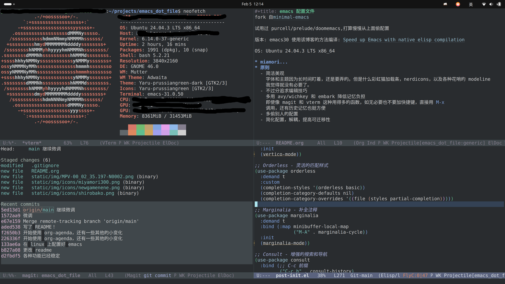

# Table of Contents

1.  [img](#org7b5d3d9)
2.  [原则](#org40bf0d7)

fork自[minimal-emacs](https://github.com/jamescherti/minimal-emacs.d)

试用过purcell/prelude/doomemacs,打算慢慢从上面偷配置

版本: emacs30 使用该博客的方法编译: [Speed up Emacs with native elisp compilation](https://www.masteringemacs.org/article/speed-up-emacs-libjansson-native-elisp-compilation)

OS: Ubuntu 24.04.3 LTS x8664

# img

# 原则

-   简洁美观
    字体和主题因为长时间盯着，还是要弄的。但是什么彩虹猫加载条，nerdicons，以及各种花哨的modeline我觉得就没有必要了。
-   不过分追求编辑技巧
    多用avy/wichkey和embark降低记忆负担
    即使像magit和vterm这种用得多的函数，如无必要也不要加快捷键，直接用 `M-x` 调用，还有历史记忆也挺方便
-   多偷别人的配置
-   简化配置，解耦，提高可迁移性

